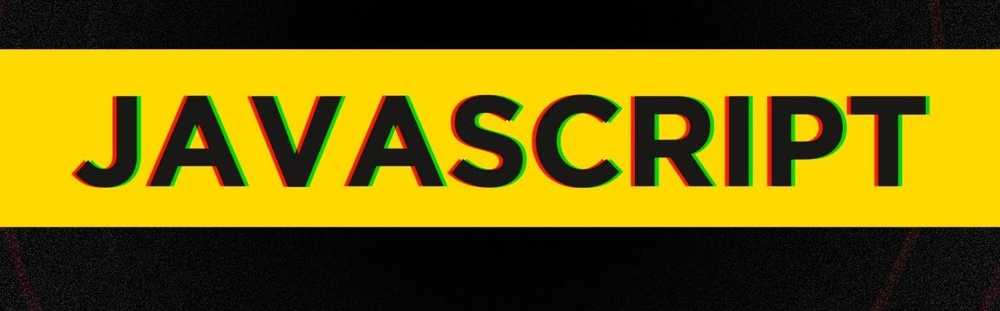

# Curso em Video Javascript

Esse repositório contém anotações referentes as aulas de **Javascript** do Curso em Vídeo.

## Módulo A - Conhecendo o JavaScript

- [Aula 01 - O que o Javascript é capaz de fazer ?](/moduloA/Aula01/)
- [Aula 02 - Como chegamos até aqui ?](/moduloA/Aula02/)
- [Aula 03 - Dando os primeiros passos](/moduloA/Aula03/)
- [Aula 04 - Criando o seu primeiro script](/moduloA/Aula04/)

## Módulo B - Comandos Básicos

- [Aula 05 - Variáveis e Tipos Primitivos](/moduloB/Aula05/)
- [Aula 06 - Tratamento de dados](/moduloB/Aula06/)
- [Aula 07 - Operadores](/moduloB/Aula07/)
- [Aula 08 - Operadores Parte 2](/moduloB/Aula08/)

## Módulo C - Entendendo o DOM

- [Aula 09 - Introdução ao DOM](/moduloC/Aula09/)
- [Aula 10 - Eventos DOM](/moduloC/Aula10/)

## Módulo D - Condições em JavaScript

- [Aula 11 - Condições Parte 1](/moduloD/Aula11/)
- [Aula 12 - Condições Parte 2](/moduloD/Aula12/)

## Módulo E - Repetições em JavaScript

- [Aula 13 - Repetições (Parte 1)](/moduloE/Aula13)
- [Aula 14 - Repetições (Parte 2)](/moduloE/Aula14)

## Módulo F - Avançando os estudos em JavaScript

- [Aula 15 - Variáveis Compostas](./moduloF/Aula15)
- [Aula 16 - Funções](./moduloF/Aula16)
- [Aula 17 - Próximos Passos](./moduloF/Aula17)
