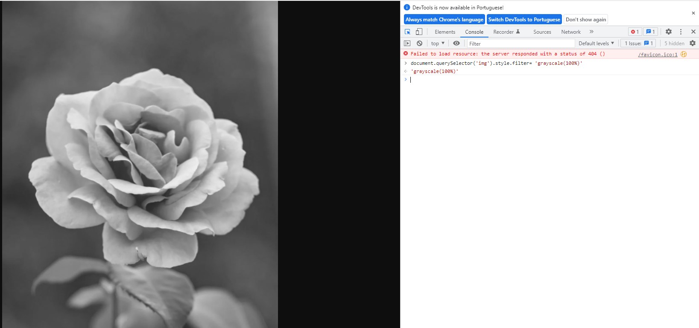

_Essas são anotações pessoais referentes a aula 01, do curso em vídeo de JS._

# Aula 01 - O que o Javascript é capaz de fazer ?

A linguagem de programação Javascript surgiu como uma tecnologia client-side, mas atualmente também pode ser utilizada no lado do servidor.

## Cliente Vs Servidor

De acordo com o [wikipedia](https://pt.wikipedia.org/wiki/Modelo_cliente%E2%80%93servidor), o modelo cliente servidor é uma estrutura de aplicação distribuída que divide cargas de trabalho e tarefas, entre os servidores de recursos ou serviços, denominados **Servidores** e os requerentes, denominados **Clientes**.

Exemplos de clientes:

- Computador
- Disposivitivo móvel

Exemplos de servidores:

- Servidor de páginas web
- Servidor de banco de dados
- Servidor de arquivos
- Servidor de serviços web

### Javascript e Cliente-Servidor na Web

No lado do cliente, em conjunto com o HTML e CSS, é utilizado na construção de páginas web, o que inclui aplicar funcionalidades através de uma lógica de programação, ou até mesmo alterações visuais, como a renderização de conteúdo. No lado do servidor, o javascript pode ser utilizado na construção de API's e outras aplicações, cujos recursos serão consumidos pelos clientes.

_O HTML é responsável pela estrutura de uma página web, enquanto o CSS é responsável por estilizações._

## Práticas

Utilizou-se o console do Chrome.

### Olá Mundo

Ao digitar o comando: `alert('Olá mundo !!!')`, obtem-se um pop-up com a mensagem **Olá mundo!!!**

### Alterarando a cor de fundo da página inicial da Google

Ao digitar o comando: `document.body.style.background = 'black'`, altera-se a cor de fundo da página para preto:

### Aplicando um filtro Tons de Cinza em uma imagem

Ao digitar o comando `document.querySelector('img').style.filter = 'grayscale(100%)'`, aplica-se um filtro de tons de cinza sobre um elemento imagem `img`.

Imagem antes do filtro:

Imagem após o filtro:

_Também é possível utilizar os seletores para selecionar outros elementos na página como por exemplo textos_
