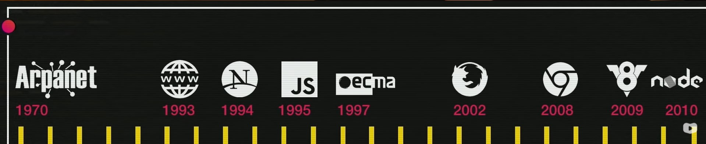

_Essas são anotações pessoais referentes a aula 02, do curso JS do Curso em vídeo._

# Aula 02 - Como chegamos até aqui ?

## Revisão da Aula 01

Q01 - Qual a principal diferença entre um cliente e um servidor na infraestrutura da internet ?
_Um cliente é responsável por fazer requisições de recursos ou serviços esses, por sua vez, são fornecidos por um ou mais servidores_

Q02 - Para que serve HTML, CSS e Javascript. Quais são as suas especialidades ?
_HTML é uma linguagem de marcação responsável pela estrutura de páginas web, enquanto CSS é a linguagem responsável por estilizações. Já o Javascript é uma linguagem que pode ser utilizada para adicionar funcionalidades, animações, ou algum tipo de lógica de programação_

Q03 - Cite 4 sites que utilizam Javascript.

1. Youtube
2. Facebook
3. Google Imagens (Scroll Infinito | Paginação)
4. Google Search (Mecanismo de Sugestão de Pesquisa)

## História do Javascript

### 1960 - 1970 - Surgimento da Internet

A Guerra Fria foi um período de tensão geopolítica entre Estados Unidos e URSS, pós 2ª Guerra Mundial, caracterizado por uma grande competição tecnológica e "psicológica". Isso porque, durante esse mesmo período, estava ocorrendo a Corrida Espacial em que as 2 nações competiam para chegar até a lua a qual, de acordo com o [wikipedia](https://pt.wikipedia.org/wiki/Corrida_espacial), foi originada pela corrida armamentista nuclear baseada em mísseis balísticos.

Inicialmente, os Estados unidos estavam perdendo, uma vez que a URSS foi responsável por lançar e colocar em órbita o primeiro satélite artificial, o Sputnik. Os Estados Unidos, não tinham muito conhecimento a respeito do satélite da URSS e de seu poder e visando se proteger passaram a investir em pesquisas voltadas à tecnologia.

Nessa época, o presidente militar Dwight D. Eisenhower decretou a criação da DARPA (Defense Advanced Research Projects Agency), uma agência de pesquisa responsável por pesquisar e desenvolver tecnologias para guerra e uma foi a **ARPAnet**. A ARPAnet era uma rede de computadores utilizada principalmente pelos militares, mas também por algumas universidades.

_Anteriormente, a comunicação e os dados militares eram fisicamente centralizados, ou seja, se o inimigo atacasse uma unidade responsável por esses recursos, todos os seus dados seriam perdidos e não haveria comunicação naquela área._

Com o passar do tempo, a ARPAnet cresceu muito e passou a se chamar Internet.

### 1993 - Surgimento do HTML, HTTP e da World Wide Web

Em 1993, [Timothy John Berners-Lee](https://pt.wikipedia.org/wiki/Tim_Berners-Lee) e sua equipe buscaram formas de melhorar a interatividade e organização dos conteúdos da rede, criando a linguagem HTML responsável por estruturar os conteúdos e permitir ligações entre eles. Assim surgiram os [Hypertextos](https://pt.wikipedia.org/wiki/Hipertexto) escritos em HTML, o protocolo HTTP e fundou-se a [World Wide Web](https://pt.wikipedia.org/wiki/WorldWideWeb)

#### MOSAIC

Tornou-se necessário um navegador que suportasse o HTTP e apresentasse páginas web. Assim, foi desenvolvido no National Center for Supercomputing Applications (NCSA) o 1º navegador, o MOSAIC, que inicialmente foi programado por [Marc Andreessen](https://pt.wikipedia.org/wiki/Marc_Andreessen) e [Eric Bina](https://pt.wikipedia.org/wiki/Eric_Bina).

### 1994 - Netscape

Em 1994, [Marc Andreessen](https://pt.wikipedia.org/wiki/Marc_Andreessen) e Jim Clark fundaram a Netscape Communications Corporation, responsável por criar um navegador que foi muito utilizado, o **Netscape**

_Curiosidade: As equipes dessa empresa eram conhecidas por dar nomes engraçados para seus projetos; um dos projetos recebeu o nome de Mozilla, em homenagem ao monstro japonoês Godzilla_

### 1995 - Surgimento do Javascript

Em 1995, o desenvolvedor [Brendan Eich](https://pt.wikipedia.org/wiki/Brendan_Eich) foi contratado pela Netscape com o intuito de criar uma solução que melhorasse limitações do HTML, adicionando mais funcionalidades. Brendan possuía um projeto de linguagem de programação que inicialmente era chamado de [Mocha], que posteriormente foi mudado.

A linguagem recebeu muitos nomes, mas o último, como uma estratégia de marketing, foi Javascript. Na época, a linguagem de programação Java era conhecida como a linguagem do futuro, pois se programava uma vez e os programas poderiam funcionar em vários dispositivos diferentes, o que a tornou muito popular.

### 1997 - A popularização do Javascript e sua padronização

A linguagem Javascript tornou-se tão popular que algumas empresas decidiram "criar a sua própria versão", o que com o tempo poderia causar problemas legais com os criadores da linguagem original. Com isso, a Netscape decidiu que era necessário padronizar o Javascript e para isso, contou com a ajuda de outra empresa, mais especificamente a **ECMA** (Associação Europeia de Computadores).

### 2002 - A queda da Netscape e o Surgimento da Fundação Mozilla

A ascensão do navegador Internet explorer, baseado no código do Mosaic, tomou o mercado com a popularização do Windowns 95, já que esse já vinha instalado por padrão no sistema operacional. Com isso, um dos principais produtos da Netscape Corporation, o navegador _Netscape_ foi diretamente impactado.

Com o tempo, Netscape Corporation faliu, mas grande parte da sua equipe ainda matinha o desejo de criar navegadores e assim, surgiu a fundação Mozilla e seu navegador, o Mozilla Firefox.

### 2008 - 2009 - O surgimento do Google Chrome

Em 2008, a Google trouxe para o mercado o seu próprio navegador, o Google Chrome, que em pouco tempo passou a ser extremamente utilizado. Isso se deu principalmente por um diferencial, o seu motor de código Javascript, o V8, que possuía código aberto.

### 2009 - 2010 - Node Js e o Javascript no lado do servidor

Entre 2009 e 2010, Ryan Dahl criou o uma tecnologia que permitiu que o Javascript fosse usado do lado do servidor, o [node](https://pt.wikipedia.org/wiki/Node.js), criado com base no motor V8 do Chrome, uma vez que esse era opensource.

## Timeline Diponibilizada Durante o Curso

## Outras Tecnologias derivadas ou relacionadas ao Javascript

1. React
2. React Native
3. Angular
4. Vue
5. Cordova
6. Ionic
7. JQuery
8. Electron

_Além das aplicações citadas, o javascript também pode ser utilizado para criar outros tipos de aplicações como jogos_

## Referências
* [Curso em Vídeo](https://www.youtube.com/c/CursoemV%C3%ADdeo)

## Próxima Aula
[Aula 03 - Dando os primeiros passos](../Aula03/)
