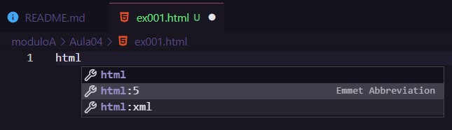
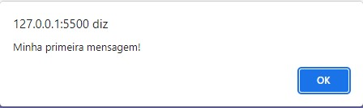

# Aula 04 - Criando o seu primeiro script

## Revisão da Aula 03

Q01 - Que livros/documentos foram recomendados na aula anterior?
**Livros:**

1. JavaScript: O Guia Definitivo - David Flanagan
2. JavaScript: O Guia do Programador - Maurício Samy Silva

**Documentações:**

1. [Referência JavaScript - Mozilla](https://developer.mozilla.org/pt-BR/docs/Web/JavaScript)
2. [JavaScript - w3schools](https://www.w3schools.com/js/)

_Obs. W3c não foi recomendado pelo professor, mas achei interessante citar_

Q02 - Para aprender JavaScript, precisamos saber inglês?
Saber inglês ajuda, mas para iniciar não é necessário saber inglês.

Q03 - Que dicas nós demos para quem quer estudar?
Certamente, praticar é a principal coisa a se fazer para estudar. Também pode-se consultar manuais, documentações, assistir vídeos, ler livros e compartilhar conhecimento.

Q04 - Quais programas foram instalados na aula passada?

1. Node Js
2. Vs Code
3. Chrome

## Prática

### Criando um arquivo HTML

1. Clique em File
2. Clique em New File
3. Crie uma pasta para manter os arquivos organizados
4. Salve o arquivo com o nome desejado e com a extensão html. `ex001.html`

Abra o arquivo e digite `html` e selecione `html:5`.

_Obs. Para abrir o arquivo html em um navegador, basta dar um clique duplo sobre ele no explorador de arquivo._

### Entendendo as marcações HMTL 5

O html não é uma linguagem de programação, mas sim de marcação. Dentre de um documento html, cria-se marcações (tags) que indicam e descrevem para o navegador a estrutura, elementos ou "configurações" da página.

As tags são representadas pelos sinais de menor `<` e maior `>`.
Atualmente, a sintaxe do html é composta principalmente por tags que representam uma região da estrutura html, que são demarcadas por tags de abertura `<tag>` e fechamento `</tag>` e outras que representam elementos ou "configurações", conhecidas como tags com autofechamento, `<tag/>.`

Principais Tags html 5:

1. `<!DOCTYPE html>` => Essa tag indica que o documento está sendo escrito em html 5
2. `<html lang="pt-br">` => Essa tag indica o início do documento html e `lang="pt-br"` indica o idioma do conteúdo da página
3. `<head>` => Indica a abertura do cabeçalho da página, região destinada a configuração da página.
4. `<meta charset="UTF-8" />` => Indica a codificação dos caracteres utilizados no documento.
5. `<title> </title>` => Indica o título da página
6. `` => Indicam a abertura e fechamento de uma região onde pode se configurar estilos para página, utilizando a linguagem CSS
7. `</head>` => Indica o fechamento do cabeçalho da página
8. `<body>` => Indica a abertura do corpo da página (Todo conteúdo que você deseja apresentar deve estar entre essas tags) 9.`` => Indica o fechamento da região de script.
10. `</body>` => Indica o fechamento da região que representa o corpo da página. 11. `</html>` => Tag de fechamento do documento html.

### Primeiros script javaScript

- `window.alert('Mensagem')` => Exibe uma mensagem em tela
- `window.confirm('Está gostando de js?')` => Exibe uma mensagem com 2 opções. Cancelar e OK.
- `window.prompt('Qual é seu nome?')` => Exibe uma entrada em que o usuário pode digitar algum texto

### Resultado

Resultado do código: 

Resultado do comando `window.alert('Minha primeira mensagem!')`:  
   
Resultado do comando `window.confirm('Está gostando de js?')`:  
   
Resultado do comando `window.prompt('Qual é seu nome?')`:  
   

Página HTML:  

#### Curiosidade

_Há uma lenda entre os programadores e ela diz que existe uma maldição. Seu 1º comando em uma tecnologia nova deve ser o Hello World ou o seu correspondente em outra lingua e caso não seja, você jamais aprenderá._

_Por que arriscar, né?_ &#128514;

## Referências

- [Curso em Vídeo](https://www.youtube.com/c/CursoemV%C3%ADdeo)

## Próxima Aula

[Módulo B - Aula 05](../../moduloB/Aula05/)
