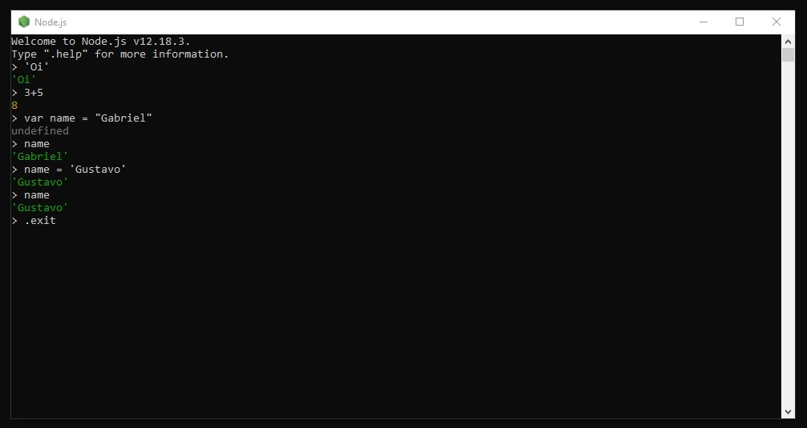
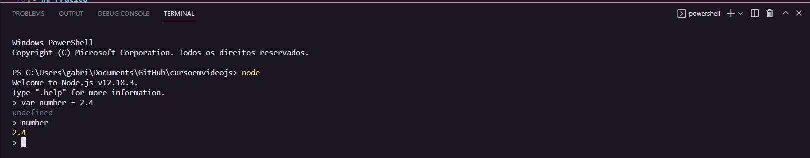
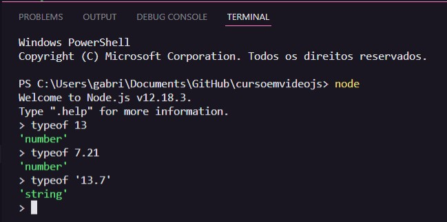
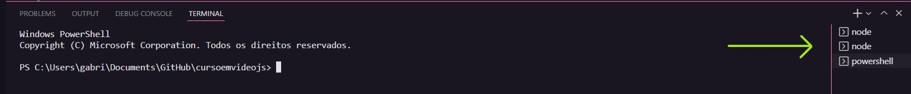

# Aula 05 - Variáveis e Tipos Primitivos

## Revisão da Aula 04

Q01 - Já sabe organizar suas pastas com VSCode?
Sim.

Q02 - O Node.js está instalado no seu computador?
Sim.

Q03 - Sabe diferenciar HTML5, CSS3 e JS dentro de um código?
Sim.

Q04 - Sabe disparar alertas, confirmações e perguntas?

- `alert()` - Alerta
- `confirm()` - Confirmação
- `prompt()` - Pergunta

_Pode-se ou não utilizar a palavra: window_

## Comentários em JavaScript

Os comentários são utilizados para colocar observações em um código.
Linhas de códigos comentadas são ignoradas durante a execução de um script.

- Comentário em linha: `//`
- Comentário multilinha: `/**/`

## Variáveis

Para armazenar dados durante a execução de um programa é necessário reservar um espaço na memória do computador, o que é conhecido como variável.
Uma variável possui uma chave (nome) e um valor atribuído a ela.

Pode-se considerar a analogia de um estacionamento:

- Esse estacionamento possui vagas para carros, motocicletas e caminhões (Tipos de dados)
- O tamanho da vaga muda de acordo com o tipo de veículo (O tamanho da variável muda conforme o tipo de dado)
- Cada vaga possui uma identificação única (Chave, nome da variável ou identificador)
- Uma vaga não pode ser ocupada por 2 veículos (Uma variável possui um único valor)
- Para estacionar um veículo B em uma vaga ocupada, primeiro deve-se retirar o veículo A estacionado (Ao atribuir um valor a uma variável existente, seu valor anterior será sobrescrito)
- Uma vaga pode estar vazia (O valor de uma variável pode ser null)

### Definindo variáveis

Atualmente, há mais de uma maneira de se definir uma variável. A forma mais comum é utilizando a palavra reservada `var` seguida de um identificador, um sinal de atribuição `=` e um valor. Exemplo:
`var number = 2`

_Também pode-se utilizar const e let_

### Identificadores

Regras para definição de nomes de variáveis

- Podem começar com letra, $ ou \_
- É possível usar letras ou números
- É possível usar acentos e símbolos

- Não podem começar com números
- Não podem conter espaços
- Não podem ser palavras reservadas da linguagem

- Nomes devem ser **coerentes com o significado** da variável
- Nomes pouco descritivos como `n1, n2, a, b, c` podem ser difíceis de se entender

_Obs. JavaScript é Case-sensitive, então ele irá diferenciar letras em maiúsculo e minúsculo_

### Principais tipos primitivos

- number (inteiros, reais, Infinity, NaN)
- string (Exemplos: "Google", 'Js', \`Mary\`)
- boolean (true e false)
- null
- undefined
- object
- function

## Prática

Inicialmente, abriu-se o terminal do node js e digitou-se alguns comandos:  

- `'Oi'` => Retorna uma string com a palavra 'Oi'
- `2+3` => Retorna o resultado da adição 2 + 3
- `var name = 'Gabriel'` => Cria variável name e atribui a ela o valor 'Gabriel'
- `name = 'Gustavo'` => Altera o valor da variável name para 'Gustavo'
- `.exit` => Sai do terminal
   
   
  

  _Obs. Para abrir o terminal do node js dentro do terminal do vscode, basta digitar `node`_
   

  

### Descobrindo o tipo de uma variável

Pode-se utilizar o comando `typeof` seguido de um identificador de variável ou de um valor para consultar seu tipo
 
 

### Número de terminais no vscode

Pode-se abrir mais de um terminal no vscode, mas o número de terminais abertos impacta no desempenho da máquina. Assim, para não sofrer problemas de desempenho, recomenda-se digitar o comando `exit` para matar o terminal do **vscode** e `.exit` para matar o terminal do **nodejs**
 
 

## Referências

- [Curso em Vídeo](https://www.youtube.com/c/CursoemV%C3%ADdeo)
- [Notas Aula 04](../Aula04/)

## Próxima Aula

[Aula 06 - Tratamento de dados](../../moduloB/Aula06/)
