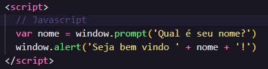
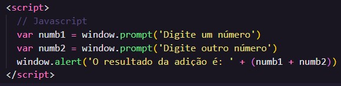
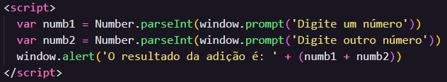
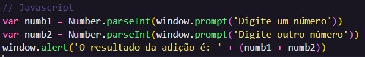
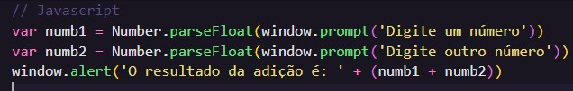

# Aula 06 - Tratamento de dados

## Revisão da Aula 05

Q01 - O que é uma variável?
É um espaço de memória endereçável ao qual se pode atribuir um valor ou expressão, durante a execução de um programa. Esse normalmente é associado a um nome, conhecido como identificador.

Q02 - Como declarar uma variável numérica Inteira ou Real usando JS ?
Atualmente, o JS possui tipagem dinâmica e desse modo, basta atribuir um valor a uma variável que seu tipo implícito será associado a ela. Assim, pode-se utilizar a palavra reservada `var` seguida de qualquer identificador, respeitando as [regras citadas anteriormente](https://github.com/GabrielGustavoMS/cursoemvideojs/tree/main/moduloB/Aula05/README.md#Identificadores), atribuindo um valor real o inteiro.

Q03 - Quais são os tipos primitivos do JS ?
Os principais tipos JS são:

1. number
2. null
3. string
4. boolean
5. undefined
6. object
7. function

Q04 - O que significa colocar o valor null dentro de uma variável?
Significa que o valor que estiver armazenado nessa variável será substituído por nulo.

## Prática

### 01 - Utilizando uma variável com prompt() e alert()

Reutilizando o [código da aula 04](https://github.com/GabrielGustavoMS/cursoemvideojs/tree/main/moduloA/Aula04/ex001.html), criou-se um script com o exemplo de uso de uma variável, capturando o nome de uma pessoa e atribuindo a uma variável através do comando `var nome = window.prompt('Qual é seu nome?')`. Em seguida, exibiu-se em tela uma mensagem com o comando `window.alert('Seja bem vindo ' + nome + '!')`.

_Note utiliza-se o sinal + para "unir" uma variável a uma string. Isso recebe o nome de concatenação_

#### Resultado:

Resultado do comando `var nome = window.prompt('Qual é seu nome?')` :  

Resultado do comando `window.alert('Seja bem vindo ' + nome + '!')`:  

[Script ex002](https://github.com/GabrielGustavoMS/cursoemvideojs/tree/main/moduloB/Aula06/ex002.html)

### 02 - Convertendo tipos

O comando `window.prompt()` sempre devolverá uma **string**, mas as vezes é necessário utilizar outros tipos. Para isso, pode-se utilizar conversões de tipos.

Um exemplo disso é a operação de adição; o operador `+` é utilizado para adição e concatenação. A adição ocorre quando ele está entre números somente e quando a uma string como um dos operandos, ocorrerá a concatenação.

Usa-se `(` e `)` para alterar a ordem de precedência dos operadores, de forma semelhante a matemática.

#### Problema 01 - Somar 2 números inteiros

Imagine que precisamos somar 2 entradas (2 e 5) digitadas por um usuário e exibir o resultado em tela, que deve corresponder a 7. Desse modo testamos as seguintes soluções:

**Solução 1**

``

A solução 1 na verdade apresenta um resultado incorreto, pois a adição não deveria resultar em 25. Desse modo, verifica-se que os 2 números digitados pelo usuário estão sendo tratados como string.

**Solução 2**
Na 2ª solução realizamos a conversão das entradas em formato de string para números inteiros utilizando o comando:  
`Number.parseInt()`

``

Note que a solução 2 resolve o problema, pois soma corretamente os números.

#### Problema 02 - Somar 2 números reais

Imagine que precisamos somar 2 entradas (6.5 e 6.5) digitadas por um usuário e exibir o resultado em tela, que deve corresponder a 13. Desse modo testamos as seguintes soluções:

**Solução 1**
Nessa solução, basicamente replica-se a solução do 1º problema, contida no [script ex003-02.js](https://github.com/GabrielGustavoMS/cursoemvideojs/blob/main/moduloB/Aula06/ex003-02.js).

``

Obteve-se 12 como resultado, ou seja, a solução está incorreta e não resolve o problema. Isso ocorreu porque ao converter um número real para inteiro, a parte real é "ignorada".

**Solução 2**
Para essa solução, utiliza-se o comando `Number.parseFloat()` para converter as entradas para números reais.

``

## Referências

- [Curso em Vídeo](https://www.youtube.com/c/CursoemV%C3%ADdeo)
- [Wikipedia - Variável](<https://pt.wikipedia.org/wiki/Vari%C3%A1vel_(programa%C3%A7%C3%A3o)>)
