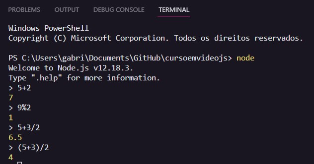
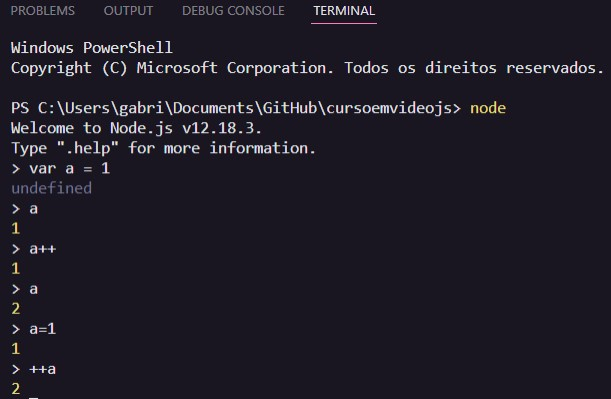
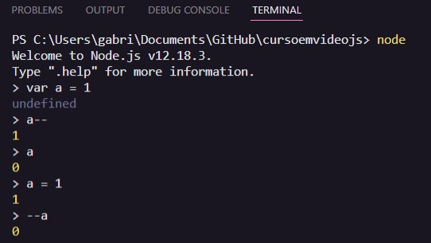

# Aula 07 - Operadores

## Revisão da Aula 06

Q01 - Como é possível guardar o valor digita em um prompt() dentro de uma variável?
Basta utilizar o sinal de atribuição da seguinte forma: `var algo= prompt('Digite algo')`

Q02 - Como fazer com que um número digitado em um prompt() possa ser usado em um cálculo?
Um `prompt()` retorna uma string que pode ser convertida para o tipo number utilizando `Number.parseInt(string)` ou `Number.parseFloat`. Também pode-se utilizar uma sintaxe curta: `Number(string)`.

Q03 - Como transformar um texto to para letras MAIÚSULAS?
Pode-se realizar a formatação da seguinte forma: 
`var texto = 'algum texto'` 
`var textUP = texto.toUpercase()` 
`console.log(textUP)` 
**Como saída obteremos: `ALGUM TEXTO`**

Q04 - Como mostrar um número formatado como um valor monetário?
Pode utilizar o método: `.toLocaleString()`. Veja o exemplo abaixo: 
`var numb = 13` 
`numbLC = numb.toLocaleString('pt-BR',{style: currency, currency: 'BRL'})` 
`console.log(numbLC)` 
**Usando o node, como saída obteremos: R$13.00**

## Tipos de Operadores

Os **operadores** são símbolos que representam determinadas operações que são aplicadas sobre os **operandos**. Os principais tipos de operação que classificam os operadores são:

- Aritméticos
- Atribuição
- Relacionais
- Lógico
- Ternário

Exemplo: `2 + 3`, nesse caso 2 e 3 são operandos e + é o operador.

### Operadores aritméticos

Esse operadores são reponsáveis por operações matemáticas, tais como:

- Adição: `5 + 2` => 7
- Subtração: `5 - 2` => 3
- Multiplicação: `5 * 2` => 10
- Divisão: `5 / 2` => 2.5
- Resto da divisão inteira: `5 % 2` => 1
- Potência: `5 ** 2` => 25

Outros exemplos a seguir: 

### Operadores de atribuição

Esses operadores são responsáveis por atribuir / associar um valor a uma variável; principais exemplos:

- Atribuição Simples: `var a = 5 + 2`
- Auto Atribuição: `var n = n + 1`, `var n = n - 1`,`var n = n * 2`,`var n = n / 13`, `var n = n % 5`, `var n = n ** 2`
- Atribuição de Adição: `var n += 1`
- Atribuição de Subtração: `var -= 1`
- Atribuição de Multiplicação: `var *= 2`
- Atribuição de Divisão: `var /= 13`
- Atribuição de Resto: `var %= 5`
- Atribuição de Potência: `**= 2`

### Operadores de Incremento de Decremento

Esses operadores são utilizados para alterar o valor de uma variável numérica em 1 unidade.
Por exemplo:

#### Incremento

`var a = 1` 
`a++` => Nesse caso o valor de a será equivalente a `a = a + 1`, ou seja, `2`.  

  

_Note que no exemplo acima a ordem a++ ou ++a varia o resultado que é apresentado no terminal. No primeiro caso, em que se usa a++,o incremento ocorrerá após a exibição do valor de a; já no segundo caso, ++a o incremento ocorre antes da exibição do valor_

#### Decremento

`var a = 1` 
`a++` => Nesse caso o valor de a será equivalente a `a = a - 1`, ou seja, `0`.  

  

_Note que no exemplo acima a ordem a-- ou --a varia o resultado que é apresentado no terminal. No primeiro caso, em que se usa a--,o decremento ocorrerá após a exibição do valor de a; já no segundo caso, --a o decremento ocorre antes da exibição do valor_

## Precedência dos operados

Como na matemática, as operações são realizadas em uma ordem específica, a precedência. A precedência determina qual operação deve ser realizada primeiro.

_Note que é possível alterar a precedência utilizando parênteses `(` `)`_

Ordem de precedência dos principais operadores, da mais alta para a mais baixa:

1. `( )`
2. `**`
3. `* / %`
4. `+ -`

Você pode saber mais sobre a ordem de precedência no [manual de desenvolvedores js da mozilla](https://developer.mozilla.org/pt-BR/docs/Web/JavaScript/Reference/Operators/Operator_Precedence)
