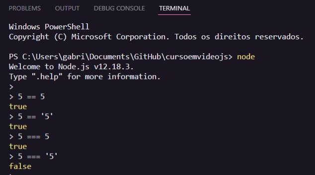
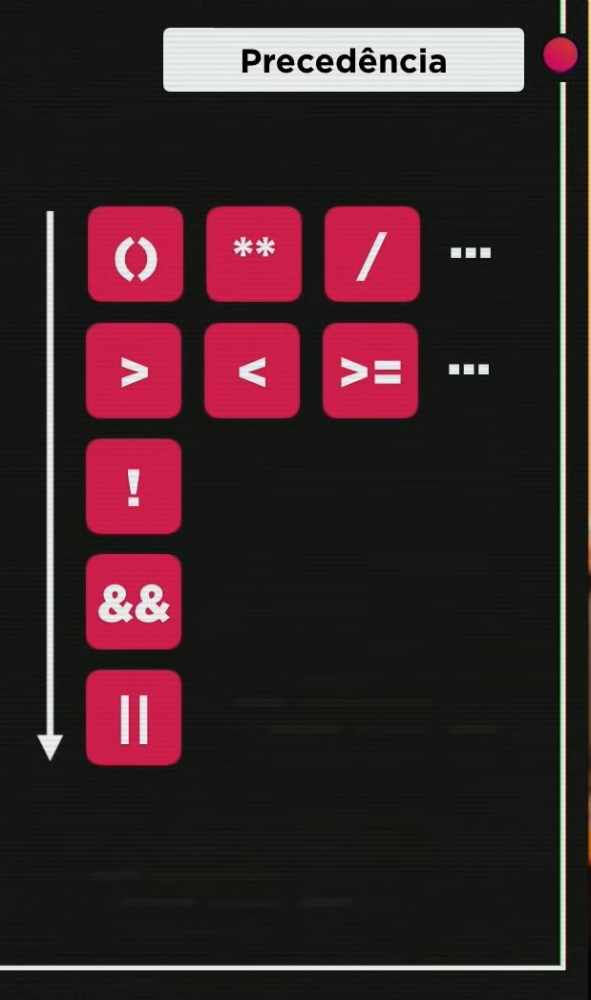
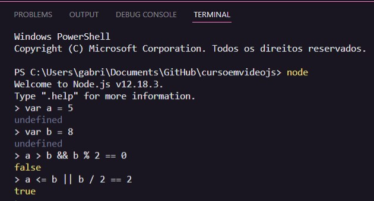

# Aula 08 - Operadores Parte 2

## Revisão da Aula 07

Q01 - Para que serve o operador % em Js? Seria para calcular a porcentagem?
Não. O operador % serve para calcular o resta da divisão inteira.

Q02 - 6 + 4 / 2 é igual a 5 ou 8?
É igual a 8, pois o operador de divisão tem maior precedência em relação ao de subtração.

Q03 - Se uma variável n está valendo 10 e executamos um n+=5, qual será seu novo valor?
Seu novo valor será 15.

Q04 - Para que servem os operadores ++ e --?
Ambos alteram o valor de uma variável em 1 unidade, ++ acresce e -- decresce

## Tipos de Operadores

Os operadores são símbolos que representam determinadas operações que são aplicadas sobre os operandos. Os principais tipos de operação que classificam os operadores são:

- Aritméticos
- Atribuição
- Relacionais
- Lógico
- Ternário

Exemplo: `2 + 3`, nesse caso 2 e 3 são operandos e + é o operador.

### Operadores Relacionais

Os operadores relacionais sempre tem como resultado da operação, um valor booleano. Esses operadores são responsáveis por operações relacionais, as quais normalmente questiona-se como um operando a esquerda se relaciona com um operando a direita, do operador.

Se a resposta para o questionamento que representa uma relação for sim, então o disse que a relação é verdadeira e assim retornar-se-á o valor true. Caso contrário, false.

_Note que o símbolo -> indica a saída da operação, para esse exemplo e que no lugar dos números, poderia se utilizar variáveis numéricas_

- É Maior?: `5 > 2` -> `true`
- É Menor?:`7 < 4` -> `false`
- É Maior ou Igual a?`8 >= 8 ` -> `true`
- É Menor ou Igual a?`9 <= 7` -> `false`
- É Igual a?`5 == 5` -> `true`
- É Diferente de?`4 != 4` -> `false`

#### Identidade

Note que, em JavaScript, `5 == '5'` é verdadeiro, ou seja, o valor 5 do tipo number e o valor '5' do tipo string são iguais.
Para verificar se os operandos são iguais em valor e do mesmo tipo, deve-se utilizar o operador de identidade, representado por `===`.

Abaixo um exemplo comparando as saídas do operador `==` (É Igual a?) e `===` (É identico a?)   

_Também há o operador `!==`, chamado de desigual restrito. Ele é semelhante ao `!=`, mas assim como o `===` também avalia o tipo dos operandos_

### Operadores Lógicos

Esses operadores são responsáveis por operações lógicas, ou seja, eles atuam com base na lógica booleana e tem como entrada valores booleanos, para realizar:

- Negação: `! A`
- Conjunção: `A && B`
- Disjunção: `A || B`

_A e B podem ser valores booleanos ou expressões que resultam em valores booleanos_
 
 

#### Tabela verdade - Operador de negação

Note que o operador de negação é unário e atua como um inversor. Caso o operando a sua esquerda seja `true`, o resultado da operação será `false` e vice-versa.

| Entrada A | Saída   |
| --------- | ------- |
| `true`    | `false` |
| `false`   | `true`  |

 
 

#### Tabela verdade - Operador de Conjunção

Note que o operador de conjunção, também conhecido como operador E, só resultará em `true` quando ambos operandos de entrada forem `true`.

| Entrada A | Entrada B | Saída   |
| --------- | --------- | ------- |
| `true`    | `true`    | `true`  |
| `true`    | `false`   | `false` |
| `false`   | `true`    | `false` |
| `false`   | `false`   | `false` |

_Note que quando o operador de conjunção é negado, seu resultado será idêntico ao da tabela verdade do operador de disjunção_
 
 

#### Tabela verdade - Operador de Disjunção

Note que o operador de disjunção, também conhecido como operador OU, só resultará em `false` quando ambos operandos de entrada forem `false`.

| Entrada A | Entrada B | Saída   |
| --------- | --------- | ------- |
| `true`    | `true`    | `true`  |
| `true`    | `false`   | `true`  |
| `false`   | `true`    | `true`  |
| `false`   | `false`   | `false` |

_Note que quando o operador de disjunção é negado, seu resultado será idêntico ao da tabela verdade do operador de conjunção_
 
 

## Ordem de Precedência

1. Operadores Aritméticos
2. Operadores Relacionais
3. Operadores Lógicos

Abaixo uma capitura de tela com a ordem de precedência apresentada no curso de js do curso em vídeo:  

 

### Ordem de Precedência dos Operadores Lógicos

1. Negação
2. Conjunção
3. Disjunção

_Nota pessoal: Não me lembro dos operadores lógics ter ordem de precedência entre sí, mas estou apenas replicando o que foi passado no curso!_

## Prática

