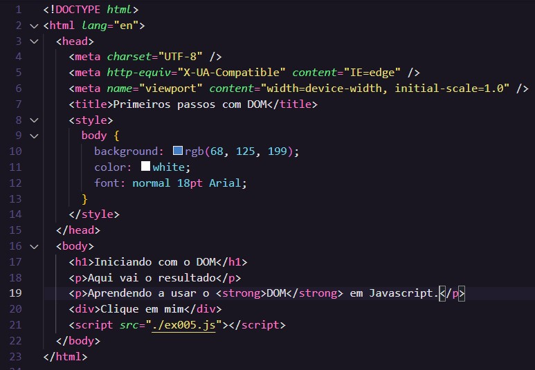
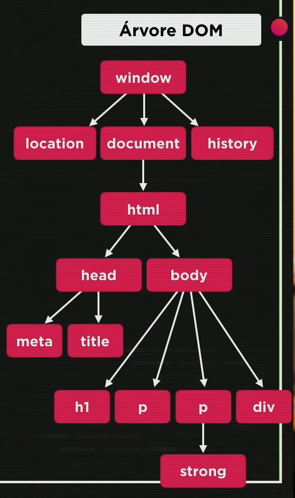
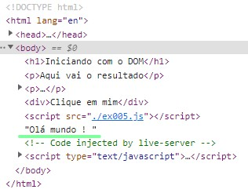
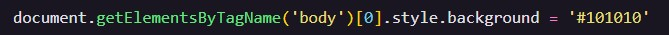
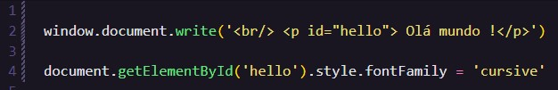
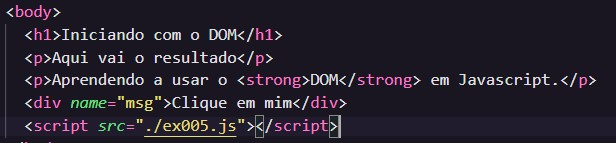
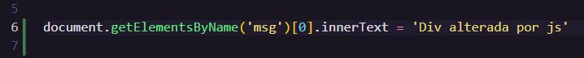
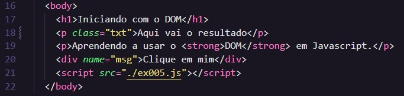
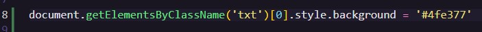
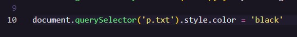

# Aula 09 - Introdução ao DOM

## Revisão da Aula 08

Q01 - Qual é a diferença entre usar `=`, `==` e `===` em códigos estritos em JS?

1. `=` é o operador de atribuição simples, ele é usado para atribuir um valor a uma variável
2. `==` é o operador relacional que compara igualdade sem considerar os tipos dos operandos
3. `===` é o operador relacional identidade que compara igualdade considerando tipos dos operandos

Q02 - Em uma mesma expressão, temos que os operadores `&&` e `||`. Quem deve ser resolvido primeiro?

De acordo com que foi passado no Curso em Vídeo, o operador de conjunção `&&` deve ser resolvido primeiro.

Q03 - Sabe usar o operador ternário para colocar um entre dois valores em uma variável?

Sim, veja o exemplo abaixo:

## Extensões usadas no Vs Code

Recomenda-se reiniciar o vscode após instalar as extensões.

### Watch in Chrome

Cria um live server para rodar e atualizar automaticamente os arquivos HTML

No momento que estou escrevendo esse arquivo, é necessário utilizar um plug-in no chrome para rodar o Watch in Chrome.
Eu particularmente prefiro utilizar o live server:  

### Node Exec

Habilita um atalho para rodar arquivos js no node apertando a tecla F8.

## O que é DOM?

É um acrônimo para **Document Object Model** ou [Modelo de Objeto de Documento](https://pt.wikipedia.org/wiki/Modelo_de_Objeto_de_Documentos). Trata-se de uma convenção independente de linguagem de programação, multiplataforma, fiscalizada pela [W3C](https://pt.wikipedia.org/wiki/W3C) adotada para representar e iterar objetos em documentos HTML, XHTML e, XML.

É através do DOM que podemos alterar o conteúdo de uma página web utilizando JS. Um exemplo disso foi realizado na primeira aula do curso.

### Árvore DOM

Para organizar os elementos / objetos, utiliza-se uma estrutura de [árvore](<https://pt.wikipedia.org/wiki/%C3%81rvore_(estrutura_de_dados)>) n-ária chamada de Árvore DOM, de forma que cada elemento é representado por um nó da árvore.

Como exemplo, considere o seguinte código HTML e sua respectiva árvore DOM:
 

Abaixo temos uma captura de tela da árvore DOM, referente ao código anterior, retirada da aula 09 do curso de Js do Curso em Vídeo:

 

## Prática

### Adicionando elementos no documento HTML com JS

Podemos utilizar o DOM para adicionar elementos em um código HTML, utilizando o seguindo comando:

`window.document.write('Olá mundo !')`

Por exemplo:

Imagine que queremos adicionar o texto `Olá mundo !` na seguinte página [ex005](./ex005.html):

Note que uma linha foi adicionada logo abaixo com o texto `Olá mundo !`:

Note que ao inspecionar o código em um navegador, pode-se notar a presença de `"Olá mundo !"`

## Selecionando elementos DOM com JS

### Por Marca (ou Tag)

Para selecionar um elemento por tag, utiliza-se:

`document.getElementsByTagName()`

_Note que `.getElementsByTagName()` retornará um vetor de elementos, como se pode notar **Elements**_

Veja o exemplo abaixo, em que alterou-se a cor de fundo da página para cinza, usando o seguinte comando:

Código JS:

Resultado em HTML:

### Por ID

Uma outra forma de selecionar, é pelo id de um elemento. Abaixo um exemplo:

Na linha 2, adicionei o atributo `id="hello"` em um parágrafo contendo o texto **Olá Mundo** e na 4, selecionei o atributo `style` e alterei a propriedade `fontFamily` para `cursive`, causando um efeito de letra cursiva somente no parágrafo com id hello.

Código Js:

Resultado em HTML:

_Não se pode atribuir o mesmo id para mais de um elemento !_

### Por nome

De forma semelhante a seleção por Tag, a seleção por nome retorna um vetor de elementos. Entretanto, a seleção ocorrerá pela propriedade name, ou seja, serão selecionados todos os elementos cujo o nome corresponde ao especificado entre `( )`.

Exemplo:

Código HTML:

Código JS:

Resultado em HTML:

_Note que o texto da div foi alterado de **Clique em mim** para **Div alterada por js**._

### Por Classe

É idêntica a seleção por nome, com exceção de que seleciona o atributo `class` no lugar de `name`.

Código HTML:

Código JS:

Resultado em HTML:

### Por Seletor (ou Query)

Uma forma mais recente, _atualmente não suportada por todos os navegadores mais antigos_, de fazer a seleção de elementos é usando uma sintaxe semelhante aos seletores css.

Código JS:

Resultado em HTML:

_Saiba mais sobre [seletores css](https://www.w3schools.com/cssref/css_selectors.asp)_
