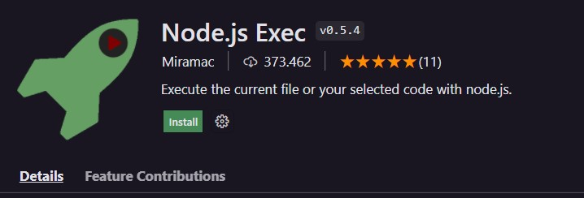

# Aula 09 - Introdução ao DOM

## Revisão da Aula 08

Q01 - Qual é a diferença entre usar `=`, `==` e `===` em códigos estritos em JS?

1. `=` é o operador de atribuição simples, ele é usado para atribuir um valor a uma variável
2. `==` é o operador relacional que compara igualdade sem considerar os tipos dos operandos
3. `===` é o operador relacional identidade que compara igualdade considerando tipos dos operandos

Q02 - Em uma mesma expressão, temos que os operadores `&&` e `||`. Quem deve ser resolvido primeiro?
De acordo com que foi passado no Curso em Vídeo, o operador de conjunção `&&` deve ser resolvido primeiro.

Q03 - Sabe usar o operador ternário para colocar um entre dois valores em uma variável?
Sim, veja o exemplo abaixo: 

## Extensões usadas no Vs Code

Recomenda-se reiniciar o vscode após instalar as extensões.

### Watch in Chrome

Cria um live server para rodar e atualizar automaticamente os arquivos HTML

No momento que estou escrevendo esse arquivo, é necessário utilizar um plug-in no chrome para rodar o Watch in Chrome.
Eu particularmente prefiro utilizar o live server:  

### Node Exec

Habilita um atalho para rodar arquivos js no node apertando a tecla F8.

