# Aula 10 - Eventos DOM

## Revisão da Aula 09

Q01 - O que significa a sigla **DOM**?

DOM é um acrônimo para Document Object Model, com ele é possível acessar elementos HTML usando JS.

Q02 - Sabe montar a árvore DOM de um Website simples?

Sim.

Q03 - O que são os elementos **Parent** e os elementos **Child** em um árvore DOM?

Dado 2 nós ligados entre si em um árvore, parent (ou pai) será o nó localizado imediatamente acima de outro nó, conhecido como child (ou filho). O DOM representa os objetos em uma árvore hierárquica, de forma semelhante a uma árvore genealógica.

Q04 - Quais são os 5 principais métodos de selecionar elementos DOM dentro do JS?

1. Seleção por Tag ou Marcação - `document.getElementsByTagName()`
2. Seleção por nome - `document.getElementsByName()`
3. Seleção por ID - `document.getElementById()`
4. Seleção por classe - `document.getElementsByClassName()`
5. Seleção por Seletor ou Query - `document.querySelector()`

## Eventos de Mouse

| Nome do evento | Quando é disparado                                                             |
| -------------- | ------------------------------------------------------------------------------ |
| mouseenter     | quando o mouse entra na área do elemento                                       |
| mousemove      | quando o mouse se move pela área do elemento                                   |
| mousedown      | quando o botão do mouse é pressionado lentamente                               |
| mouseup        | quando o botão do mouse volta para a posição original; é o oposto do mousedown |
| mouseclick     | quando o mouse recebe um click rápido                                          |
| mouseout       | quando o mouse sai da área do elemento                                         |

Saiba mais sobre eventos no [manual da Mozilla](https://developer.mozilla.org/pt-BR/docs/Web/Events)

## Funções

Bloco de instruções reutilizáveis que podem ser executados quando um evento ocorre. Para declarar uma função em JS utiliza-se a palavra reservada `function` que pode ou não ser seguida de um nome de `()`.

_Uma função será disparada somente quando ocorrer a sua chamada._

Exemplo de declaração de função:

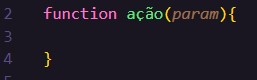

## Usando Funções e Eventos

Os eventos podem ser disparados pelo HTML através de atributos ou por JS, por meio de _listeners_.

### Exemplo de funções interagindo com o DOM

#### Evento de click

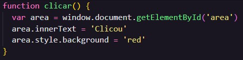

A função acima interage com o DOM selecionando um elemento HTML com id igual a _area_, armazenando-o em uma variável _area_. Após isso, ela altera a cor de fundo para _vermelho_ e o texto do elemento para _Clicou_, mas isso só ocorre com a chamada da função.

Para chamar a função, pode-se adicionar o atributo `onclick=""` no elemento HTML com ID `area`, juntamente com a chamada da função `clicar()`, dessa forma: `onclick="clicar()"`

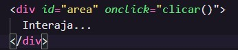

Elemento antes da interação de click:

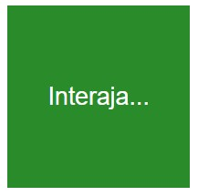

Elemento após a interação de click:

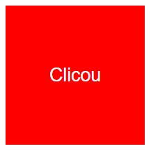

#### Evento onmouseenter

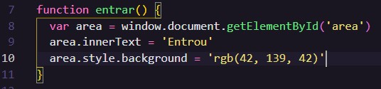

A função acima interage com o DOM selecionando um elemento HTML com id igual a _area_, armazenando-o em uma variável _area_. Após isso, ela altera a cor de fundo para _verde_ e o texto do elemento para _Entrou_, mas isso só ocorre com a chamada da função.

Para chamar a função, pode-se adicionar o atributo `onmouseenter=""` no elemento HTML com ID `area`, juntamente com a chamada da função `entrar()`, dessa forma: `onmouseenter="entrar()"`

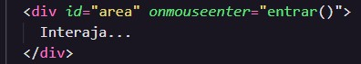

Elemento antes da interação de onmouseenter:

Elemento após a interação onmouseenter:

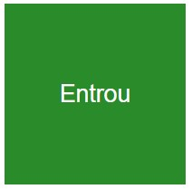

#### Evento onmouseout

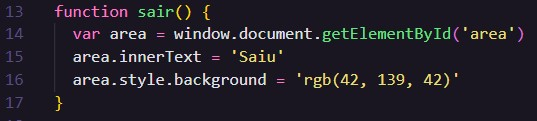

A função acima interage com o DOM selecionando um elemento HTML com id igual a _area_, armazenando-o em uma variável _area_. Após isso, ela altera a cor de fundo para _verde_ e o texto do elemento para _Saiu_, mas isso só ocorre com a chamada da função.

Para chamar a função, pode-se adicionar o atributo `onmouseout=""` no elemento HTML com ID `area`, juntamente com a chamada da função `sair()`, dessa forma: `onmouseout="sair()"`

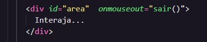

Elemento antes da interação de oumouseout, considerando que o elemento não foi clicado:

Elemento após a interação oumouseout:

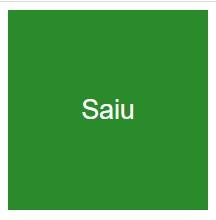

### Listeners

Uma alternativa para os exemplos anteriores, seria usar ouvintes ou listeners no JS, no lugar atributos de eventos no html. Abaixo a reprodução de um código js com o mesmo efeito usando listeners

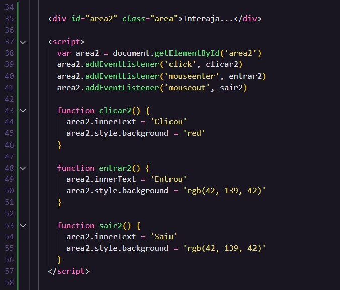

Note que a _div_, já não possui os atributos de eventos **on**algumacoisa.

Utilizou-se `elementoHtml.addEventListener('nomeEvento', nomeFunção)`

## Resolvendo Problemas de Sintaxe

Problemas com a sintaxe são comuns. Uma forma de encontrá-los é utilizando a ferramenta **inspect** ou em **ferramentas para desenvolvedores**, que podem ser acessadas apertando a tecla F12 do teclado, no Chrome.

Abaixo um erro de sintaxe:

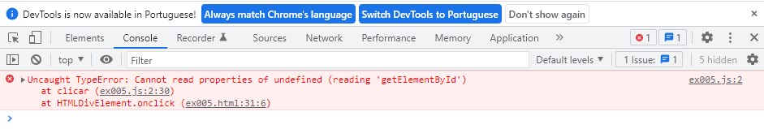

Nesse exemplo, substituiu-se o w minúsculo da palavra window na linha 2 da função clicar, por W maiúsculo. Dessa forma:

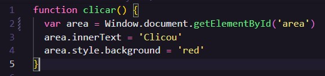

_Note que o console devolve algumas informações como o tipo do erro, a função, o número da linha e até o elemento html de onde se originou o evento_

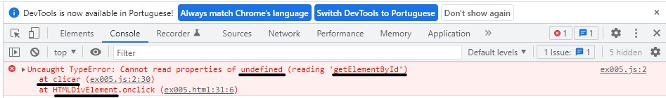

_Dica: Na maioria das vezes, copiar e colar as mensagens de erros no google facilitará a sua vida. Provavelmente você encontrará alguma solução, em algum site, principalmente no [Stack Overflow](https://pt.stackoverflow.com/)_

## Prática

Note abaixo que utilizei tanto css quando js em arquivos externos. Isso é importante para manter a organização entre os arquivos.

Código HTML:

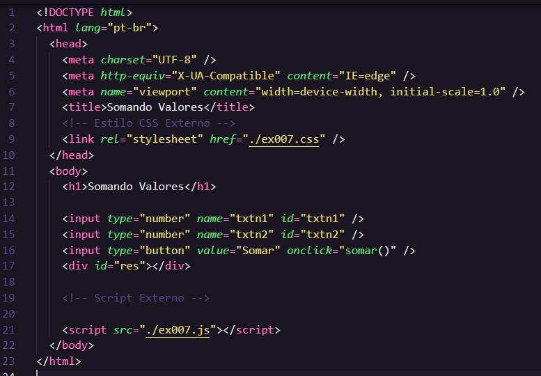

Código JS:

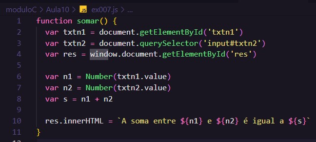

Código CSS:

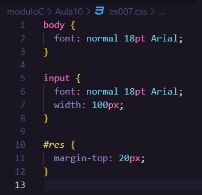

[Acesse a aplicação](https://gabrielgustavoms.github.io/cursoemvideojs/moduloC/Aula10/ex007.html)

## Referências

- [Curso em Vídeo](https://www.youtube.com/c/CursoemV%C3%ADdeo)
- [Stack Overflow](https://pt.stackoverflow.com/)
- [Manual da Mozilla](https://developer.mozilla.org/pt-BR/docs/Web/Events)
- [Notas Aula 09](../../moduloB/Aula09/)

## Próxima Aula

[Aula 11 - Condições Parte 1](../../moduloD/Aula11/)
