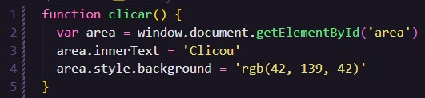

# Aula 10 - Eventos DOM

## Revisão da Aula 09

Q01 - O que significa a sigla **DOM**?

DOM é um acrônimo para Document Object Model, com ele é possível acessar elementos HTML usando JS.

Q02 - Sabe montar a árvore DOM de um Website simples?

Sim.

Q03 - O que são os elementos **Parent** e os elementos **Child** em um árvore DOM?

Dado 2 nós ligados entre si em um árvore, parent (ou pai) será o nó localizado imediatamente acima de outro nó, conhecido como child (ou filho). O DOM representa os objetos em uma árvore hierárquica, de forma semelhante a uma árvore genealógica.

Q04 - Quais são os 5 principais métodos de selecionar elementos DOM dentro do JS?

1. Seleção por Tag ou Marcação - `document.getElementsByTagName()`
2. Seleção por nome - `document.getElementsByName()`
3. Seleção por ID - `document.getElementById()`
4. Seleção por classe - `document.getElementsByClassName()`
5. Seleção por Seletor ou Query - `document.querySelector()`

## Eventos de Mouse

| Nome do evento | Quando é disparado                                                             |
| -------------- | ------------------------------------------------------------------------------ |
| mouseenter     | quando o mouse entra na área do elemento                                       |
| mousemove      | quando o mouse se move pela área do elemento                                   |
| mousedown      | quando o botão do mouse é pressionado lentamente                               |
| mouseup        | quando o botão do mouse volta para a posição original; é o oposto do mousedown |
| mouseclick     | quando o mouse recebe um click rápido                                          |
| mouseout       | quando o mouse sai da área do elemento                                         |

Saiba mais sobre eventos no [manual da Mozilla](https://developer.mozilla.org/pt-BR/docs/Web/Events)

## Funções

Bloco de instruções reutilizáveis que podem ser executados quando um evento ocorre. Para declarar uma função em JS utiliza-se a palavra reservada `funtion` que pode ou não ser seguida de um nome de `()`.

_Uma função será disparada somente quando ocorrer a sua chamada._

Exemplo de declaração de função:

## Usando Funções e Eventos

Os eventos podem ser disparados pelo HTML através de atributos ou por JS, por meio de _listeners_.

### Exemplo de funções interagindo com o DOM

### Evento de click

A função acima interage com o DOM selecionando um elemento HTML com id igual a _area_, armazenando-o em uma variável _area_. Após isso ela irá alterar a cor de fundo e o texto do elemento, mas isso só ocorrerá com a chamada da função.

Para chamar a função, pode-se adicionar o atributo `onclick=""` no elemento HTML com ID `area`, juntamente com a chamada da função `clicar()`, dessa forma: `onclick="clicar()"`

Elemento antes da interação de click:

Elemento após a interação de click:

