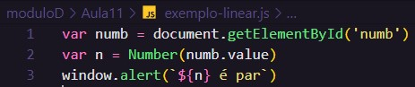

# Aula 11 - Condições Parte 1

## Revisão Aula 10

Q01 - Consegue citar 3 eventos que podem acontecer com elementos do DOM de um site?

1. onmouseenter
2. onmouseout
3. onclick

Q02 - O que é uma função? Como criar funções em JS?

É um bloco de instruções / código encapsulado que pode ser reutilizado / invocado por qualquer trecho de um programa.

Q03 - Sabe como pegar os valores de caixas de texto e fazer cálculos com eles.

Os valores podem ser obtidos selecionando um elemento DOM e acessando sua propriedade value; Normalmente é necessário convertê-los para number antes de fazer um cálculo.

## A importância das condições

Considere o seguinte trecho de código js:

O trecho de código acima captura um valor numérico digitado pelo usuário e emite um alerta informado que esse é par.

**O problema** é que mesmo que o usuário informe um número ímpar, ele sempre apresentará que o número é par. Entranto, considere que queremos apresentar uma mensagem informando que o número é par somente quando o n for par:

**se o valor de n for par, o programa deve emitir um alert**

Para representar isso em JS, utilizamos uma condição simples:

