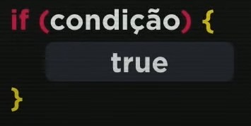
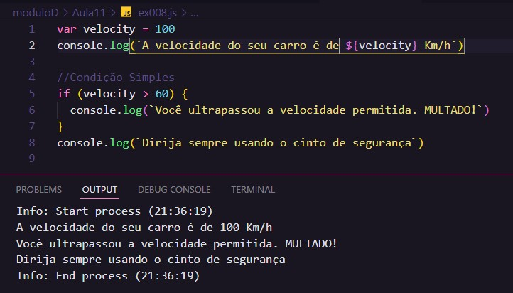
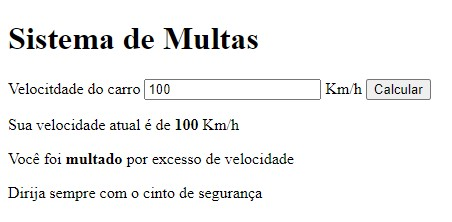

# Aula 11 - Condições Parte 1

## Revisão Aula 10

Q01 - Consegue citar 3 eventos que podem acontecer com elementos do DOM de um site?

1. onmouseenter
2. onmouseout
3. onclick

Q02 - O que é uma função? Como criar funções em JS?

É um bloco de instruções / código encapsulado que pode ser reutilizado / invocado por qualquer trecho de um programa.

Q03 - Sabe como pegar os valores de caixas de texto e fazer cálculos com eles.

Os valores podem ser obtidos selecionando um elemento DOM e acessando sua propriedade value; Normalmente é necessário convertê-los para number antes de fazer um cálculo.

## A importância das condições

Considere o seguinte trecho de código js:

O trecho de código acima captura um valor numérico digitado pelo usuário e emite um alerta informado que esse é par.

**O problema** é que mesmo que o usuário informe um número ímpar, ele sempre apresentará que o número é par. Entranto, considere que queremos apresentar uma mensagem informando que o número é par somente quando o n for par:

**se o valor de n for par, o programa deve emitir um alert**

Para representar isso em JS, utilizamos uma condição simples:

Note que as condições são **desvios no fluxo** do programa, ou seja, considerando uma linguagem de programação imperativa, em que os comandos são executados linha a linha seguindo um "fluxo padrão", pode-se criar a possibilidade de um comando ser ou não executado de acordo com uma condição.

### Tipos de condição

Há mais tipos de estruturas condicionais, mas nesse aula foi apresentado somente:

#### Condição Simples

Se a condição for verdadeira um bloco de instrução será executado, se for false o programa seguirá seu "fluxo padrão". Abaixo a representação da estrutura condicional simples, apresentada no Curso em Vídeo:

_A condição simples possui apenas o bloco de instrução se_

#### Condição Composta

É semelhante a condição simples, porém pode-se especificar o que ocorrerá caso a condição seja falsa e para isso adiciona-se a palavra reservada `else` (senão) ao final do bloco de instrução precedido por `if`. Abaixo a representação da estrutura condicional composta, apresentada no Curso em Vídeo:

_A condição simples possui o bloco de instrução se e senão_

## Prática

### Exercício 008

 
 

### Exercício 009

 
 

### Exercício 010

[Acesse a aplicação](https://gabrielgustavoms.github.io/cursoemvideojs/moduloD/Aula11/ex010.html)

 
 

### Desafio

[Acesse a aplicação](https://gabrielgustavoms.github.io/cursoemvideojs/moduloD/Aula11/desafio.html)

## Referências

- [Curso em Vídeo](https://www.youtube.com/c/CursoemV%C3%ADdeo)
- [Notas Aula 10](../../moduloC/Aula10/)

## Próxima Aula

[Aula 12 - Condições Parte 2](../Aula12/)
