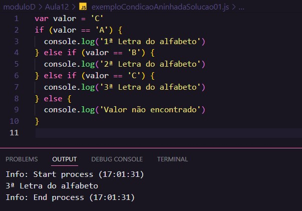

# Aula 12 - Condições Parte 2

## Revisão Aula 11

Q01 - Já sabe como utilizar a extensão **Node Exec** no VSCode?
Sim. Ela pode ser usada apertando a tecla de atalho F8, dentro de um arquivo JS.

Q02 - Sabe criar uma **condição** em seu programa JS?
Sim .
`if(condicao){`
`//Code`
`}`

Q03 - Consegue diferenciar **condições simples** e as **condições compostas**?
Sim. Condições simples possuem somente um bloco de instrução para o caso da condição ser verdadeira, já a composta possui um bloco demarcado pela palavra reservada `else{//code }`, para o caso da condição ser falsa.

## Condições Aninhadas

Até agora foram apresentadas 2 formas de condição, Simples e Composta. Conforme visto anteriormente, a condição composta adiciona um bloco de instrução para representar "o que deve acontecer" quando um condição não é atendida.

Mas e se fosse necessário adicionar mais condições a serem avaliadas quando a primeira condição fosse falsa?

Assim surge o conceito de condição aninhada. Para ficar mais claro, basta imaginar que é possível adicionar uma condição dentro da outra da seguinte forma:

`if(condicao){`
`//code1`
`} else {`
` if(condicao2){`
` //code2 } else{`
` //code3`
` }`
`}`

Note que a medida que se adiciona condições aninhadas dessa forma, também se compromete a legibilidade no código. Para isso surgiu o comando `else if(){}` que é utilizado para criar condições aninhadas da seguinte forma

`if(condicao){`
`//code1`
`} else if(condicao2) {`
` //code2`
`}else{`
`//code3`
`}`

 
 

Abaixo um fluxograma que representa uma condição aninhada:

_Fonte: Curso em Vídeo_

 

Abaixo o código JS que representa uma condição aninhada:

_Fonte: Curso em Vídeo_

## Condição Múltipla

Por exemplo: Imagine que se quer avaliar a igualdade entre valores, mais especificamente o valor de uma variável, uma expressão.
Na condição múltipla utiliza-se as seguintes palavras reservadas:

- `switch`
- `case`
- `break`
- `default`

Pode-se resolver o problema das seguintes formas:

### Solução 01 - Condição Aninhada

_Fonte: Elaborada pelo autor_

### Solução 02 - Condição Múltipla

_Fonte: Elaborada pelo autor_

Note que a palavra reservada `case ` seguida de um valor e `:` marca o início de um bloco de instruções, enquando `break` delimita seu fim. Já `default` pode ser "equivalente" ao `else`, caso a exepressão que está sendo avaliada não corresponda a algum `case`, as intruções "dentro" do bloco `default` serão executadas.

_`break` é obrigatório para marcar o fim do bloco `case`._

## Prática

### Voto

Nesse exercício criou-se uma função para verficiar a obrigatoriedade do voto no Brasil, com base na idade.

Código JS:

_Fonte: Elaborada pelo autor_

Saída:

_Fonte: Elaborada pelo autor_

### Saudações

Nesse exercício criou-se um programa JS para retornar saudações, com base no horário atual do sistema no momento em que for executado.

Código JS:

_Fonte: Elaborada pelo autor_

Saída:

_Fonte: Elaborada pelo autor_

### Dia da Semana

Nesse exercício criou-se um programa JS que retorna o dia da semana por extenso, com base na data do sistema o momento em que for executado.

## Referências

- [Curso em Vídeo](https://www.youtube.com/c/CursoemV%C3%ADdeo)
- [Notas Aula 11](../Aula11/)

## Próxima Aula

[Aula 13 - Repetições (Parte 1)](../../moduloE/Aula13/)
