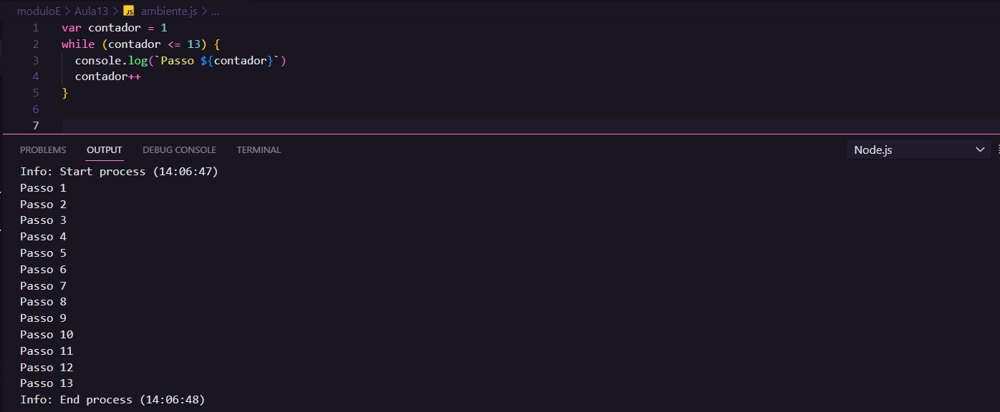
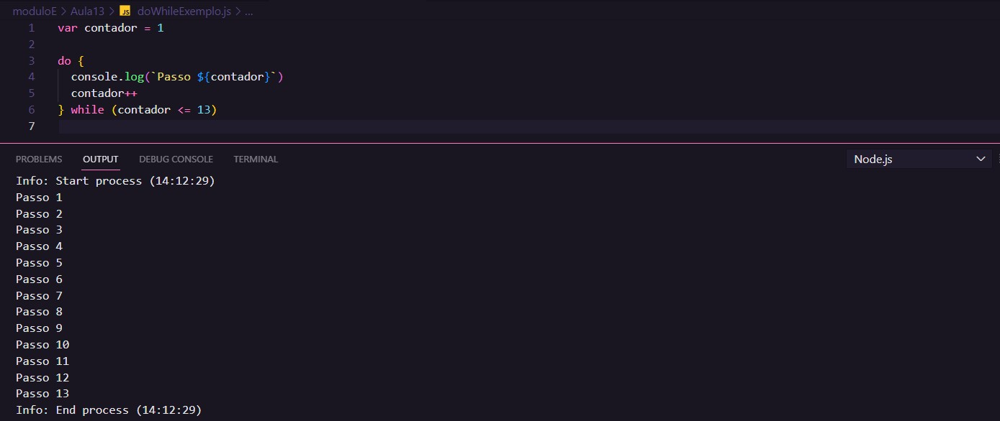

# Aula 13 - Repetições (Parte 1)

## Revisão Aula 12

Q01 - Sabe mudar a cor de fundo de um site dinamicamente, usando JS?

Sim. Abaixo um exemplo:

`document.body.style.background = '#000'`

Q02 - Consegue inserir uma imagem dentro do site sem ter a tag `` previamente criada?

Sim. Para isso pode-se realizar o seguinte:

1. Criar o elemento HTML e armazená-lo em uma variável: `var img = document.createElementy('img')`
2. Configurar o endereço da imagem por meio de seu atributo source: `img.setAttribute('src','./caminhoDaImagem/img.extensão')`
3. Adicionar elemento criado em alguma parte do DOM: `ELEMENT.appendChild(img)`

Q03 - Já treinou bastante o uso de condições?

Sim.

## Repetições

Quando se programa, busca-se por exemplo solucionar um problema, partindo de um ponto "A" e chegando em um ponto "B". O processo de execução de um programa se dá a partir da ordem que suas instruções são executadas; essa ordem recebe o nome de estrutura de controle.

| Estrutura  | Descrição                                                                                                                                                  |
| ---------- | ---------------------------------------------------------------------------------------------------------------------------------------------------------- |
| Sequência  | Essa é a mais. As instruções são executadas sequencialmente, uma linha após a outra.                                                                       |
| Condições  | Essa estrutura pode gerar um "desvio" na execução do programa, que ocorre quando uma condição é atendida                                                   |
| Repetições | Essa estrutura é composta por uma condição (teste lógico) que controla o número de vezes em que um determinado trecho de código / instrução será executado |

### Tipos de estruturas de repetição

Há essencialmente 3 tipos:

- Estruturas com teste lógico no início como por exemplo: `while`
- Estruturas com teste lógico no fim como por exemplo: `do while`
- Estruturas com variável de controle: `for`

#### Exemplos

_Note que para mudar o número de vezes em que se imprime "Passo nº", basta alterar unicamente o teste lógico._

## Referências

- [Curso em Vídeo](https://www.youtube.com/c/CursoemV%C3%ADdeo)
- [Notas Aula 12](../../moduloD/Aula12/)

## Próxima Aula

[Aula 14 - Repetições (Parte 2)](../moduloE/Aula14/)
