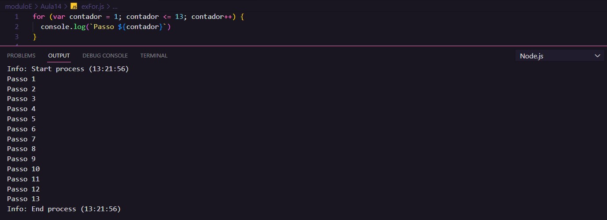

# Aula 14 - Repetições (Parte 2)

## Revisão Aula 13

Q01 - O que faço se quiser uma determinada atividade acontecer várias vezes?
Pode-se utilizar estruturas de repetição.

Q02 - Sabe diferenciar as estruturas de condição e as estruturas de repetição?
Sim.

Q03 - Consegue diferenciar estruturas **while** de **do while**?
A estrutura **while** tem seu teste lógico no início, enquanto **do while**, no final.

## Estruturas de repetição com variável de controle

Em JavaScript e na maioria das linguagens, esse tipo de estrutura é representada por:

`for (inicialização da variável; teste lógico; incremento da variável){`
`//CODE`
`}`

Como o nome sugere, há uma variável responsável pelo controle, a qual será submetida a um teste lógico, o que determinará se o bloco de instruções dentro da estrutura deve ser repetido ou não.

### Exemplo

## Referências

- [Curso em Vídeo](https://www.youtube.com/c/CursoemV%C3%ADdeo)
- [Notas Aula 13](../Aula13/)

## Próxima Aula
