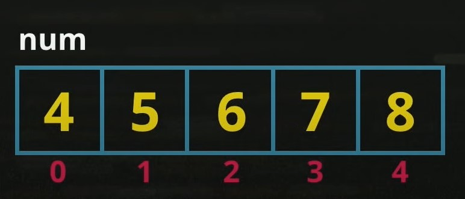

# Aula 15 - Variáveis Compostas

## Revisão Aula 14

Q01 - Já treinou bastante o uso das estruturas while, do..while e for?
Sim.

Q02 - Aprendeu a manipular objetos HTML em JS?
Sim.

Q03 - Seria interessante fatorar os códigos e torná-los menores?
Sim.

## Variáveis Compostas ou Arrays

_Conceito de Array. Fonte: Curso em Vídeo_

Variáveis simples só conseguem aramazenar um valor por vez. Já as variáveis compostas, sim.
Relebrando a analogia do início do curso, em que cada variável é correspondente a uma "vaga de estacionamento", uma vairável composta é como uma _"Coleção de Vagas"_. Essa coleção é composta por elementos, que por sua vez são compostos de chave (índice) e valor, como mostra a figura acima.

Em JavaScript, pode-se criar uma coleção ou array da seguinte forma:

`let elements = ['element0', 'element1', 'element2']`

Note que `elements` é o nome do array e o seu conteúdo é `['element0', 'element1', 'element2']`

Os índices de arrays ou vetores em JavaScript e na maioria das linguagens, são iniciados em 0. Para atribuir um valor à chave (ou posição) 0 do array, basta fazer da seguinte forma:

`elements[0] = 'new element' `

Nesse exemplo, a string que estava na posição 0 do array `elements` foi sobrescrita e passou a ter o valor `'new element'` . Ou seja, agora o conteúdo do `elements` é:

`['new element', 'element1', 'element2']`

O mesmo pode ser feito para as demais posições do array.

Para adicionar um novo elemento em um vetor, pode-se utilizar `.push('novo elemento')` o seguinte comando:

`elements.push('novo elementos')`

Agora o vetor `elements` está assim:

`['new element', 'element1', 'element2', 'novo elemento']`

### Percurso em vetor

Muitas vezes pode-se precisar "acessar" cada valor de um vetor; Como citado anteriormente, pode-se usar: `vetor[posição]`. Combinando esse comando com uma estrutura de repetição, delimitada pelo tamanho do array `vetor.length`, pode-se acessar todas as posições do vetor, como mostra a figura abaixo.

#### Tradicional:

#### EcmaScript 6:

Uma forma mais recente é utilizar essa estrutura:

_Note que a variável posição nesse exemplo, funciona com a variável i do exemplo anterior._

### Buscando elementos em vetores

Conforme mostrado no curso, pode-se utilizar o método `indexOf('elemento a ser encontrado')`, como mostram as figuras abaixo:

_Fonte: Curso em Vídeo_

_Fonte: Curso em Vídeo_

Se o valor for encontrado, o método retornará a posição (índice) desse elemento no vetor.Caso contrário, ele retornará: -1, como mostra o exemplo abaixo:

_Fonte: Imagem eleborada pelo autor_

## Referências

- [Curso em Vídeo](https://www.youtube.com/c/CursoemV%C3%ADdeo)
- [Notas Aula 14](../../moduloE/Aula14/)

## Próxima Aula

- [Aula 16 - Funções](../Aula16/)
