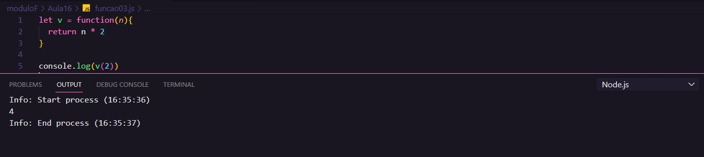

# Aula 16 - Funções

## Revisão Aula 15

Q01 - Conseguiu simplificar seus códigos com o uso de Array?
Sim.

Q02 - Sabe colocar o array em ordem usando apenas uma chamada de função?
Sim. Pode-se usar o método sort()

Q03 - Lembra como disparar uma função simples quando apertamos um botão?
Sim. Pode-se usar o atributo onclick ou adicionar uma eventListener no botão.

Q04 - Quer aprender mais sobre funções?
Sim.

## Funções

As funções são ações executadas em decorrência de um evento. São trechos de código que encapsulam uma ou mais tarefas que pode ser reutilizadas durante a execução do programa.

As funções podem possuir:

- Entrada ou parâmetros
- Saída ou retorno
- Invocação ou chamada da função

A seguir, alguns exemplos de função:

### Função Par ou Impar

Essa função verifica se o número passado por parâmetro é par ou impar

_Fonte: Elaborada pelo autor_

### Função com parâmetros predefinidos

Na ausência de um dos parâmetros, pode-se predefinir seu valor como mostra o exemplo abaixo:

_Fonte: Elaborada pelo autor_

Note que `n2` não está presente, então a função utiliza o valor `0` predefinido, somando-o com `n1`.

### Função atribuida a uma variável

Nesse exemplo, atribuiu-se uma função a uma variável.

### Função Fatorial Iterativa

Aqui utiliza-se uma estrutura de repetição para calcular o vatorial de um número.

### Função Fatorial Recursiva

Uma função recursiva é uma função que chama ela mesma.

## Exercício

Acesse o [site](https://gabrielgustavoms.github.io/cursoemvideojs/moduloF/Aula16/ex018/)

## Referências

- [Curso em Vídeo](https://www.youtube.com/c/CursoemV%C3%ADdeo)
- [Notas Aula 15](../Aula15/)

## Próxima Aula

- [Aula 17 - Próximos Passos](../Aula17/)
