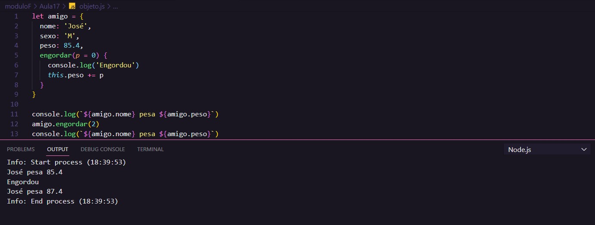

# Aula 17 - Próximos passos

Essa foi a ultima aula do curso de JavaScript do Curso em vídeo.

## Revisão da Aula 16

Q01 - Você assistiu ao curso completo?
Sim.

## Nossa rota até aqui

- Fundamentos
- Variáveis e dados
- Operadores
- Condições
- Repetições
- Arrays
- Functions
- DOM

## Próximos Passos

Estudar:

- Estudar HTML5
- Function
- Objetos
- Modularização de código
- Expressões regulares RegEX
- JSON
- AJAX
- NodeJS

## Objetos

Os objetos normalmente representam uma abstração do mundo real.

Um objeto é semelhante a um array, mas as chaves são personalizáveis. As chaves ou índices se apresentam a esquerda de `:` e o seu valor correspondente, a direita. Também pode-se armazenar funções dentro de objetos.

Pode-se declarar um objeto assim:

`let amigo = {nome:'José', sexo:'M', peso:85.4, engordar(p){}}`

## Agradecimentos

Olá, se você chegou até aqui e leu todas as minhas notas fico feliz, espero que tenha te ajudado de alguma forma.

Também deixo meus sinceros agradecimentos ao professor Gustavo Guanabara e a equipe do Curso em vídeo!

Foi realmente **Fantástico**!

## Referências

- [Curso em Vídeo](https://www.youtube.com/c/CursoemV%C3%ADdeo)

## Primeira Aula

- [Aula 1 - O que o Javascript é capaz de fazer ?](../../moduloA/Aula01/)
